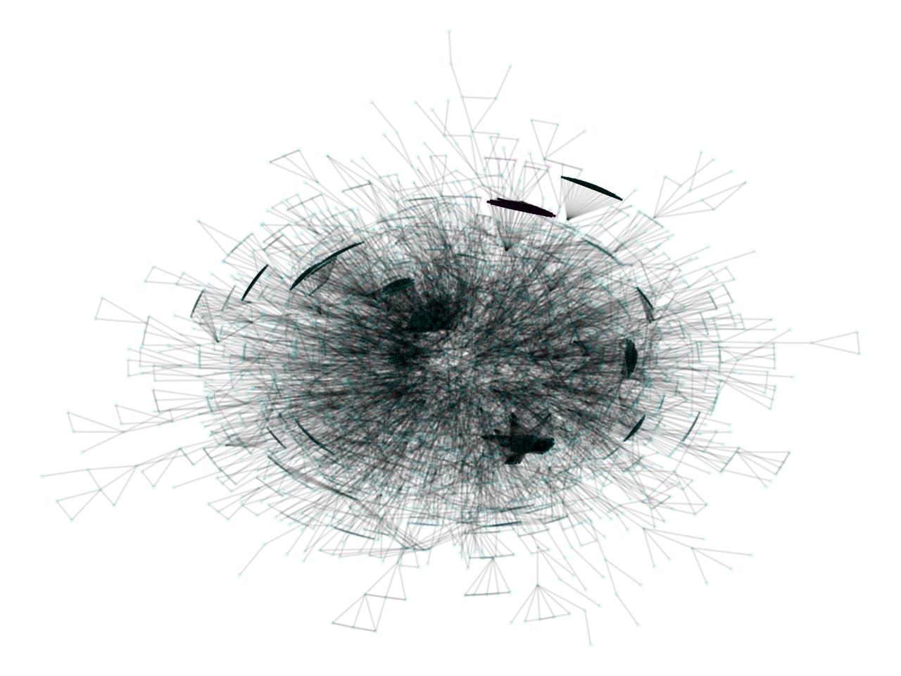
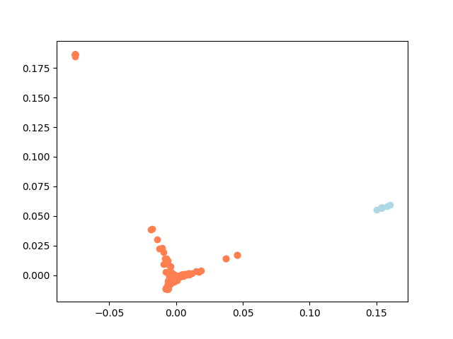

<h1 align="center">:milky_way: GraphClustering: Method to partition a graph</h1>
We will be using the following graphs from the [Stanford Network Analysis Project (SNAP)](http://snap.stanford.edu/data/index.html): ca-GrQc, Oregon-1, roadNet-CA, soc-Epinions1, and web-NotreDame

<p float="center">
  
   
</p>

<p align="center">
  Kamada-Kawai graph visualization of the ca-GrQc graph and Clustering using the Spectral Embedding 
</p>


## Dataset Statistics: 

| Graph         | #vertices | #edges  | #clusters |
|---------------|-----------|---------|-----------|
| ca-GrQc       | 4158      | 13428   | 2         |
| Oregon-1      | 10670     | 22002   | 5         |
| soc-Epinions1 | 75877     | 405739  | 10        |
| web-NotreDame | 325729    | 1117563 | 20        |
| roadNet-CA    | 1957027   | 2760388 | 50        |

## Report
-> [https://www.overleaf.com/5514615922jvndkvxytssz](https://www.overleaf.com/5514615922jvndkvxytssz)


### Spectral Graph Partitioning

 
### Requirements

1. Python 3.7+.

### Recommendations
Usage of [virtualenv](https://realpython.com/blog/python/python-virtual-environments-a-primer/) is recommended for package library / runtime isolation.


### Usage
- Install dependencies

```bash
pip install -r requirements.txt
```

- Run the clustering algorithm
```bash
usage: graph_clustering.py [-h] [--seed SEED] [--iterations ITERATIONS]
                           [--file FILE] [--outputs_path OUTPUTS_PATH]
                           [--clustering CLUSTERING]
                           [--random_centroids RANDOM_CENTROIDS]
                           [--distance_metric DISTANCE_METRIC]
                           [--compute_eig COMPUTE_EIG] [--k K]
                           [--networkx NETWORKX] [--eig_kept EIG_KEPT]
                           [--normalize_laplacian NORMALIZE_LAPLACIAN]
                           [--invert_laplacian INVERT_LAPLACIAN]
                           [--second SECOND]
                           [--eig_normalization EIG_NORMALIZATION]
```

## Authors

👤 **Alvaro Orgaz and Adrià Cabeza**

- [@alvarorgaz](https://github.com/alvarorgaz)
- [@adriacabeza](https://github.com/adriacabeza)
