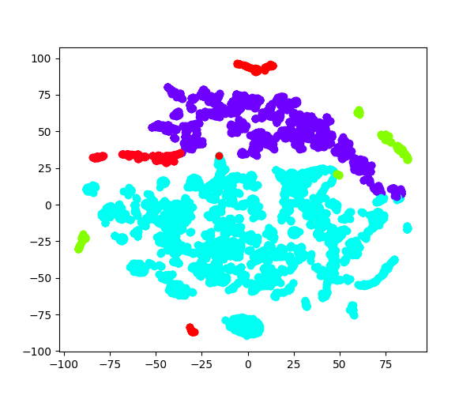

<h1 align="center">:milky_way: GraphClustering: Method to partition a graph</h1>

We will be using the following graphs from the [Stanford Network Analysis Project (SNAP)](http://snap.stanford.edu/data/index.html): ca-GrQc, Oregon-1, roadNet-CA, soc-Epinions1, and web-NotreDame

<p align="center">

  <br>
  Visualization of 5 first eigenvectors of Oregon-1 and its clusters after running K-Way Spectral Algorithm
</p>


## Dataset Statistics: 

| Graph         | #vertices | #edges  | #clusters |
|---------------|-----------|---------|-----------|
| ca-GrQc       | 4158      | 13428   | 2         |
| Oregon-1      | 10670     | 22002   | 5         |
| soc-Epinions1 | 75877     | 405739  | 10        |
| web-NotreDame | 325729    | 1117563 | 20        |
| roadNet-CA    | 1957027   | 2760388 | 50        |

## Report
-> [https://www.overleaf.com/5514615922jvndkvxytssz](https://www.overleaf.com/5514615922jvndkvxytssz)


### STUFF WE CAN TRY

- Recursive bi-partitioning: use the eigenvector with second smallest eigenvalue (Fiedler vector) to bipartition the graph by finding the best splitting point:
  - Pick a constant value (0, or 0.5).
  - Pick the median value as splitting point.
  - Look for the splitting point that has the minimum Ncut value:
    1. Choose n possible splitting points.
    2. Compute Ncut value.
    3. Pick minimum.
    
- K-way Spectral Algorithm: Take the first k eigenvectors and then use k-means to make clusters using the eigenvectors as features (http://ai.stanford.edu/~ang/papers/nips01-spectral.pdf)


### Requirements

1. Python 3.7+.

### Recommendations
Usage of [virtualenv](https://realpython.com/blog/python/python-virtual-environments-a-primer/) is recommended for package library / runtime isolation.


### Usage

- Install dependencies
```bash
pip install -r requirements.txt
```

- Run the clustering algorithm
```bash
python3 graph_clustering.py --file NAME_OF_THE_FILE --normalize BOOLEAN --k NUMBER_OF_CLUSTERS
```

## Authors

👤 **Alvaro Orgaz and Adrià Cabeza**

-  [@alvarorgaz](https://github.com/alvarorgaz)
- [@adriacabeza](https://github.com/adriacabeza)
